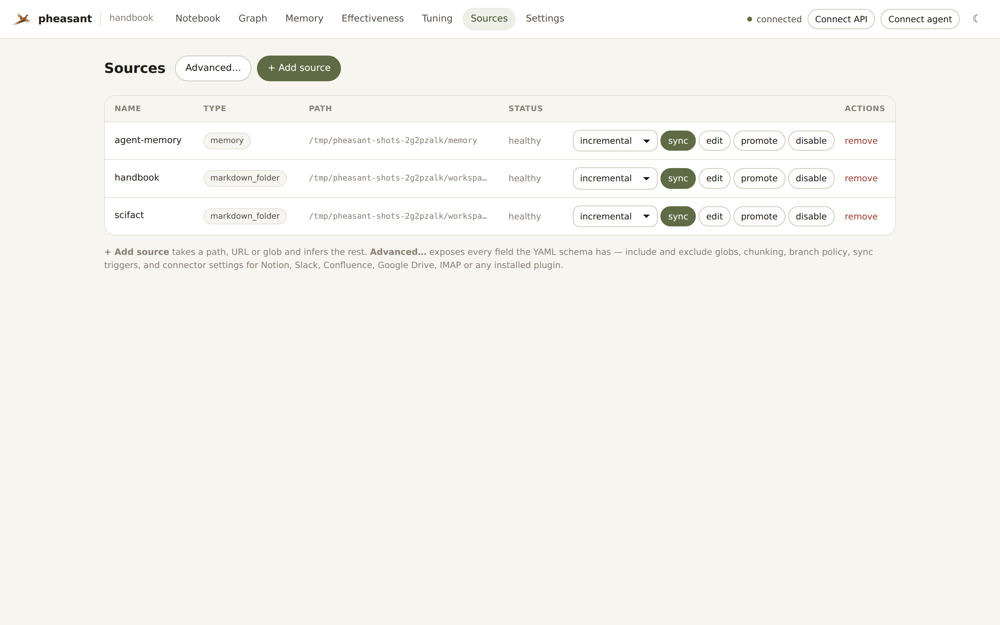
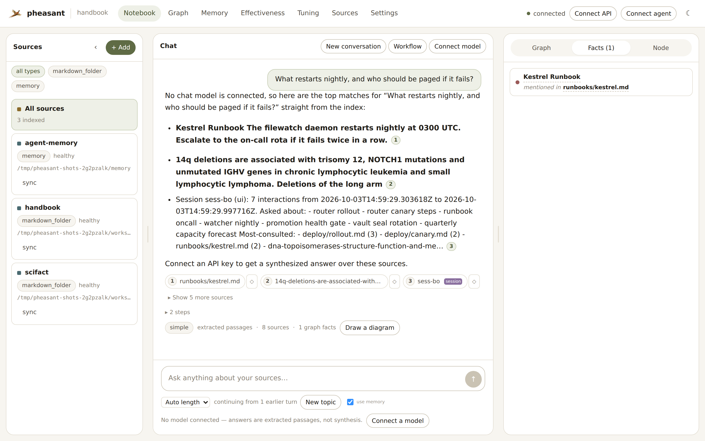
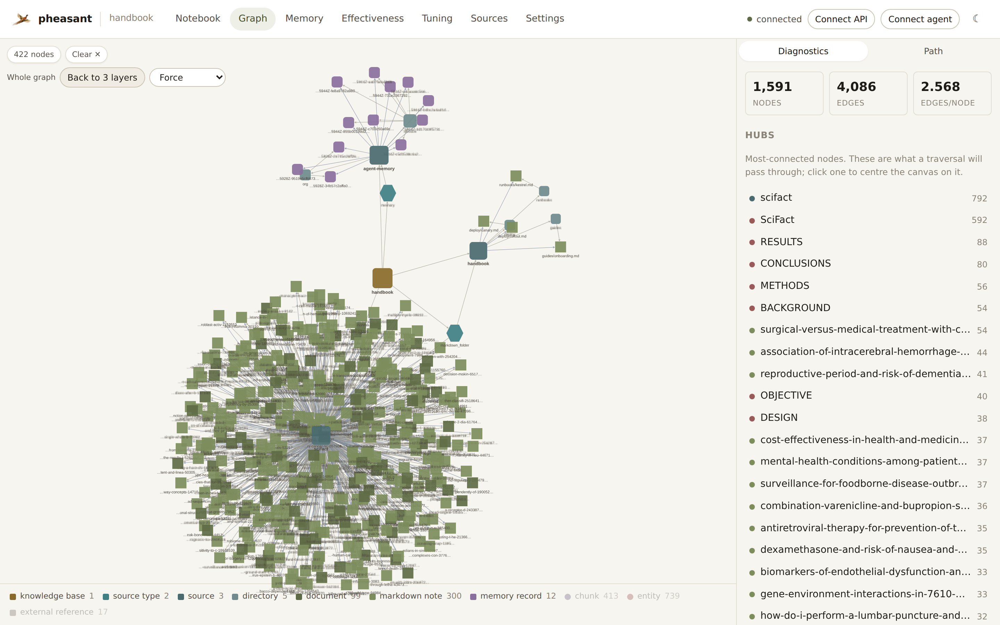
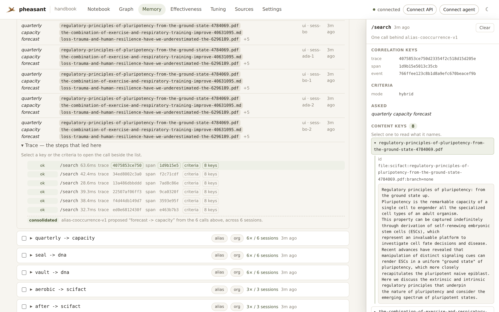
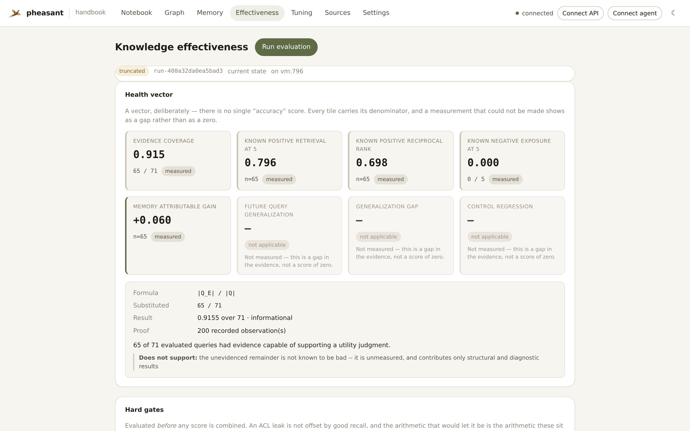
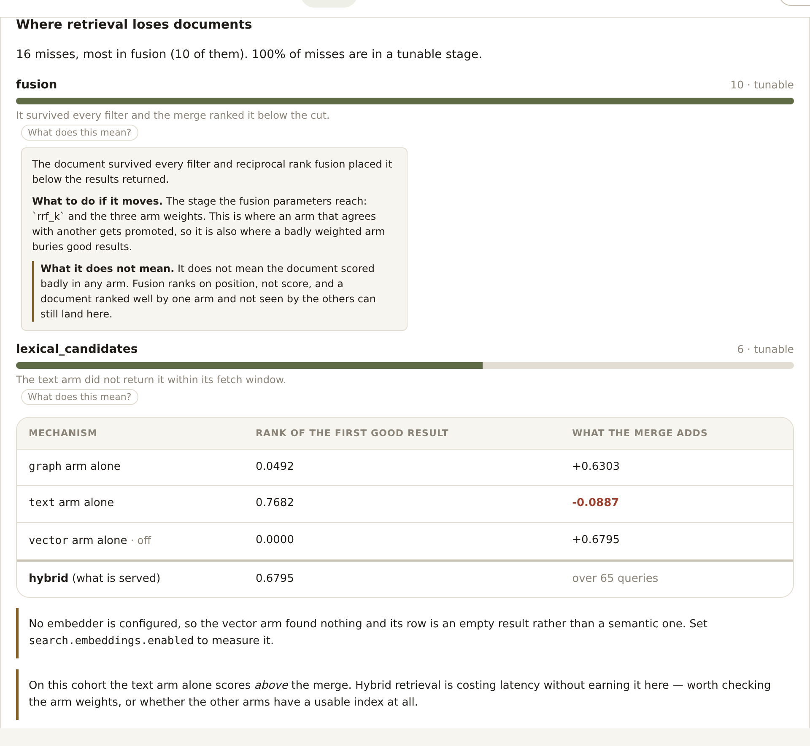

<p align="center">
  
</p>

<h1 align="center">pheasant</h1>

<p align="center">
  <em>A knowledge harness for you and your agents: your sources, indexed into one searchable, cited knowledge base.</em>
</p>

<p align="center">
  <a href="#quick-start">Quick start</a> ·
  <a href="#a-tour">Tour</a> ·
  <a href="#whats-in-the-box">What's in the box</a> ·
  <a href="#deploy">Deploy</a> ·
  <a href="docs/index.md">Docs</a>
</p>

---

## What it is

pheasant is a **knowledge harness**: it connects the things you already have to
the people and agents that need them. Point it at code repositories, folders of
notes and documents, PDFs and Office files, websites, APIs or Google Drive,
and it indexes them into one knowledge
base you can search, ask questions of and map as a graph. Answers cite the
passages they came from, and agents can read and write durable memory alongside
the sources.

```
your sources  →  pheasant indexes them  →  three ways to ask
```

| Ask from | What you get |
|---|---|
| **The web UI** at `127.0.0.1:8765` | A place to search, browse the knowledge graph and manage sources |
| **MCP**, at `/mcp` or over stdio | Claude Code, Cursor, VS Code and any MCP client search your knowledge base as a tool |
| **The HTTP API** | The same search and answers, for your own applications |

All three run the same index and the same ranking. It ships as one container
with no database to stand up, no broker and no API key; nothing leaves the
machine unless you connect a model.

## Quick start

```bash
docker run -p 127.0.0.1:8765:8765 \
  -v "$PWD:/workspace:ro" \
  -v pheasant-state:/state \
  ghcr.io/esatt10/pheasant
```

Open <http://127.0.0.1:8765>. Pheasant writes its own initial configuration,
indexes `/workspace`, and serves the UI, the HTTP API and the MCP endpoint from
that one address.

Prefer to stay on the host? `pip install pheasant-kb` then `pheasant up .` does
the same thing without Docker.

## A tour

### Point it at your sources

<p align="center">
  
</p>

A source is a path, a URL, a glob or a ZIP; pheasant infers the rest. Sync is
**incremental by default**—re-syncing a corpus nothing has touched does no
work, because unchanged content is skipped by checksum before it is even read.

### Ask it things

<p align="center">
  
</p>

Every answer cites where each passage came from. With no model connected,
pheasant answers extractively from the index; connect an API key and the same
retrieval gets synthesized into prose instead. The answer's trace shows what
each search stage did and how long it took, and while a short answer is being
checked its draft streams in, marked as a draft until the citations verify.

Behind it are three retrieval arms—full-text, vector and graph—merged by
reciprocal rank fusion, so a query matches on wording, on meaning and on how
documents relate to each other.

### Draw it, then rearrange it

<p align="center">
  
</p>

Ask for a picture—"draw the release process", "a timeline of the incidents",
"a UML class diagram of the roles"—and the answer comes with a visual in one of
eighteen shapes. Every box and arrow cites the passages that support it;
dashed ones do not, and a diagram that would be mostly guesswork is declined
with the reason.

**Expand** opens the visual at the full size of the window, where you can
drag its nodes into a layout that reads the way you want. Every arrow follows
the node it touches, **Reset layout** puts the drawn layout back exactly, and
**Collapse** (or Esc) returns to the chat with your layout kept.

<p align="center">
  
</p>

<p align="center">
  
  
</p>

It is the same view an MCP host such as Claude renders for
`ask_knowledge_base`, `create_visual` and `get_image`, so a diagram looks and
behaves the same for an agent's user as it does here. The Expand button appears
only in hosts that can give the view the whole window (the MCP Apps
`ui/request-display-mode` request); elsewhere the view is exactly as before.
Twelve shapes can be rearranged; sequence, timeline, 2×2, chart, table and
groups expand but stay put, because moving a node off its lifeline, axis or
cell would make the picture say something the passages did not.

→ [Answers, conversations and visuals](docs/how-to/conversations-and-visuals.md)

### Hand it to your coding agent

```bash
pheasant client-config claude-code -o .mcp.json   # or: cursor, vscode
```

That writes the config for you; any other MCP client can point at
`http://127.0.0.1:8765/mcp` directly. Your agent then gets tools to search, to
ask a grounded question, to explain a node, to walk the graph, and to read and
write memory—the same surface the UI uses. The UI's **Connect agent** button
shows the same snippet and the full tool list.

→ [Attach a coding agent](docs/how-to/attach-to-coding-agent.md) ·
[MCP tools and resources](docs/mcp_tools.md)

### See how it fits together

<p align="center">
  
</p>

Files, directories, symbols, headings, entities and memory records become
nodes; the edges between them are what the graph arm searches and what "explain
this" traverses. The shape is legible at a glance—here, one knowledge base
joining a documentation tree, a cluster of memory records and an indexed corpus.
The panel beside it ranks the hubs a traversal will pass through.

See [the graph model](docs/graph_model.md) for the full grammar.

### Let it remember

<p align="center">
  
</p>

Memory records are ordinary Markdown files, indexed like everything else—so
recall is just search, and a correction supersedes an old record rather than
overwriting it.

Pheasant can also **propose** memories from how it is actually being used: here
it noticed six sessions searching for `forecast` and reading documents that say
`capacity`, and proposes the alias. Open a proposal and it shows the calls it
was mined from, so "why was this suggested" ends at real content rather than at
a hash. Nothing proposed is retrievable until you promote it, and a rejection is
permanent.

→ [The memory system](docs/memory-system.md) ·
[How memories are formed](docs/memory-formation.md)

### Know whether it is actually working

<p align="center">
  
</p>

"Did the sync succeed" and "is this knowledge base any good" are different
questions. The Effectiveness page answers the second, and deliberately publishes
no single accuracy score: every tile carries the denominator it was computed
over, a measurement that could not be made shows as a gap rather than a zero,
and hard checks like ACL leakage are evaluated *before* anything is averaged, so
a good score cannot offset a broken invariant.

→ [Knowledge effectiveness](docs/knowledge-effectiveness.md)

### Fix retrieval when it isn't

<p align="center">
  
</p>

Retrieval is a pipeline, and after the merge every failure looks the same—an
absent result. Tuning attributes each miss to the **first** stage that lost it
and says whether a parameter can even reach that stage, then searches the
stages it blamed and gates the winner against a held-out set. When the problem
is upstream (documents simply not in the corpus) it proposes nothing and says
so.

```bash
pheasant tune diagnose        # which step is losing documents. Changes nothing.
pheasant tune run             # search the blamed stages, gate a winner
pheasant tune show            # what the region ranks with, and where that came from
pheasant tune apply <id>      # make a bundle the fleet's overlay
pheasant tune rollback        # back to the base, or --to an earlier bundle
```

→ [Retrieval performance tuning](docs/retrieval-tuning.md)

<details>
<summary><b>About these screenshots, and the corpus behind the numbers</b></summary>

<br>

Every screenshot is generated by
[`scripts/screenshot_ui.py`](scripts/screenshot_ui.py) against a real region it
seeds and indexes—nothing is mocked for the camera. The proposed memories are
genuinely mined from searches the script performs, and the effectiveness and
tuning numbers come from real batches, which is why some tiles honestly read
"not enough evidence" and some runs decide to change nothing.

The corpus is **[SciFact](https://github.com/allenai/scifact)**, one of the BEIR
tasks: 395 scientific abstracts (a quarter written as real PDFs, so the
extraction path is exercised too), 60 claims and 66 **expert relevance
judgements**. That last number is the point—a demo corpus whose known-positives
were invented by its own seeding script measures the seeding script. It also
makes the numbers comparable to something outside this repository, and lets the
ablation report an unflattering finding: hybrid scores *below* the text arm
here, because the graph arm adds little on scientific prose.

The corpus is fetched at screenshot time and never vendored; the test suite
never touches it and stays offline.

</details>

### Prove it can be measured

Before an experiment treats a region's answers as evidence, somebody has to
establish that they *are* evidence: that every submitted write reconciles, that
every result traces to an exact source location, that no forbidden content
crosses an isolation boundary, and that a failure which moved a denominator is
visible rather than absent.

```bash
pheasant readiness contract   # what this build supports — and what it does not
pheasant readiness check      # probe the region; exit 0 only on GO
```

A check is executable rather than a checklist: it submits documents to a
scratch source it owns, retries them under one idempotency key, seals a
snapshot, ingests to make it drift, and asserts the pinned search *refuses*.
Two capabilities are declared unsupported with their reasons, because a region
that says what it cannot do is usable and one that overclaims wastes an
experiment. A gate set with skipped gates reports `INCOMPLETE`, never `PASS`.

→ [Stress-test readiness](docs/stress-test-readiness.md)

## What's in the box

| | |
|---|---|
| **Ingest** | Git repositories, folders, single files, web pages and APIs. Every text format a codebase carries is read by default — source in ~40 languages, config, IaC, build files, Dockerfiles, notebooks, CSVs and logs — and 23 languages become graph structure: symbols, calls, and imports resolved to the files they name. Web pages can be added from YAML, `pheasant up <url>`, the UI or an agent over MCP, and each page is re-checked on its own schedule: hourly while it changes, backing off to every few days while it does not. Seven document formats (`.pdf`, `.docx`, `.pptx`, `.xlsx`, `.doc`, `.rtf`, `.epub`) extract real text; images are captioned and audio transcribed into the same searchable space, offline by default. |
| **Connectors** | Google Drive ships first-party; third-party plugins resolve by source type, optionally inside a WASM sandbox. |
| **Retrieval** | Full-text (BM25), vector (LanceDB) and graph arms fused by reciprocal rank fusion, with source, section, node-type and principal filters available identically on MCP and HTTP. |
| **Answers** | Grounded, cited answers through MCP, HTTP or the UI—extractive with no model connected, synthesized with one. Optional per-request deadlines, staged hybrid retrieval and an answer-concurrency cap (`429 ASSISTANT_BUSY`) keep latency bounded under load. |
| **Memory** | Durable agent memory as searchable Markdown, with supersession, time travel (`as_of`), per-scope isolation and reviewable proposals. |
| **Measurement** | Effectiveness evaluation and per-stage retrieval tuning, both off by default and read-only when on. |
| **Readiness** | A machine-readable capability contract and executable go/no-go gates for using this region as an experiment's substrate: ingestion receipts, sealed snapshots, per-result lineage, isolation proofs and structured refusal codes. |
| **Operations** | Idempotent, incremental sync; SQLite or PostgreSQL; backup, restore and Parquet exports; Prometheus metrics. |
| **Scale** | Optional NATS queue, gRPC preparation workers, split API/indexer/worker roles and corpus sharding—each a selectable backend, never a prerequisite. |

The defaults are the dependency-free ones. SQLite, local text search, HTTP, no
queue and a single `--role all` process is a complete, supported deployment;
everything above is something you turn on when you need it.

<details>
<summary><b>Also: pheasant can join a federated fleet</b></summary>

<br>

Pheasant is the **region** half of [Synapse](https://github.com/esatt10/pheasant-flock).
Each container can publish a semantic contract describing what it knows; a
router scores those contracts and fans a global query out to the regions that
can answer it. It is entirely optional and off by default—a router-less
pheasant is a complete product. See
[pheasant as a Synapse region](docs/SYNAPSE_INTEGRATION.md).

</details>

## Deploy

Deployment files live under [`deploy/`](deploy/). Pick the smallest profile that
fits the workload:

| Profile | Use it for |
|---|---|
| [`local-small.yaml`](deploy/compose/local-small.yaml) | Offline, local SQLite and text search |
| [`local-advanced.yaml`](deploy/compose/local-advanced.yaml) | Single node with LanceDB, OpenAI, WASM and agentic retrieval |
| [`fleet.yaml`](deploy/compose/fleet.yaml) | PostgreSQL, NATS and horizontally scaled gRPC workers |

Commands, environment variables and operational notes are in the
[`deploy/compose` guide](deploy/compose/README.md). Kubernetes and Helm
manifests are in [`deploy/`](deploy/) too; local IDE agents can use the
repository's [`pheasant-deploy` skill](.agents/skills/pheasant-deploy/SKILL.md)
to assemble a deployment.

## Configure

Don't hand-write `pheasant.yaml`. The setup flow reads the live schema, so it
cannot drift from the code:

```bash
pheasant setup                    # interactive
pheasant setup --accept-defaults  # non-interactive
```

- [Set pheasant up](docs/how-to/setup.md) ·
  [Configuration reference](docs/configuration.md) ·
  [Configure sources](docs/how-to/sources.md)
- [Run the UI](docs/how-to/run-the-ui.md) ·
  [Attach a coding agent](docs/how-to/attach-to-coding-agent.md) ·
  [Monitor indexing](docs/how-to/monitor-indexing.md)
- [Capacity planning](docs/how-to/capacity-planning.md) ·
  [Scale a worker fleet](docs/how-to/worker-fleet.md) ·
  [Backup and restore](docs/how-to/backup-restore.md)

Everything else—every command, route and MCP tool—is in the
[interface matrix](docs/reference/interfaces.md).

## Develop

```bash
pip install -e ".[dev,mcp]"
pytest -q
ruff check src tests
```

Read [`CLAUDE.md`](CLAUDE.md) before changing the codebase. It carries the
architecture, the invariants and the canonical validation commands.

## License

Apache 2.0—see [LICENSE](LICENSE).
