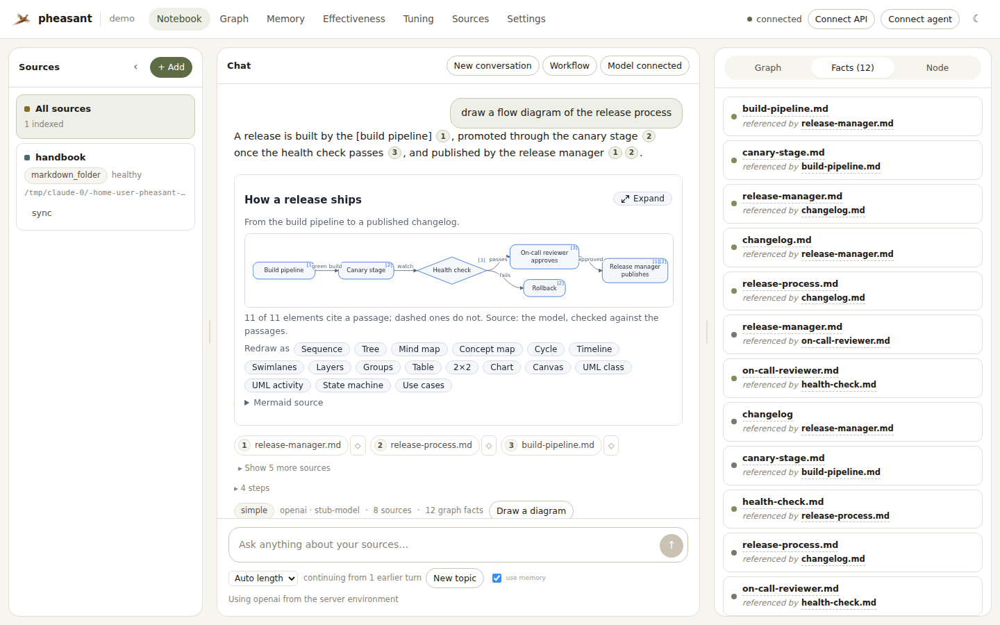
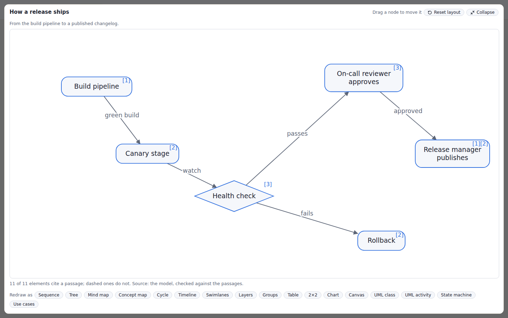
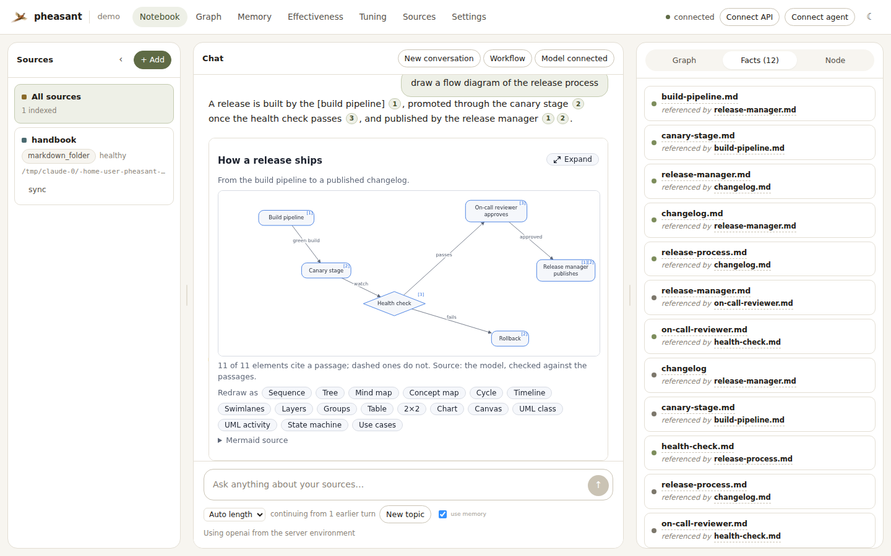
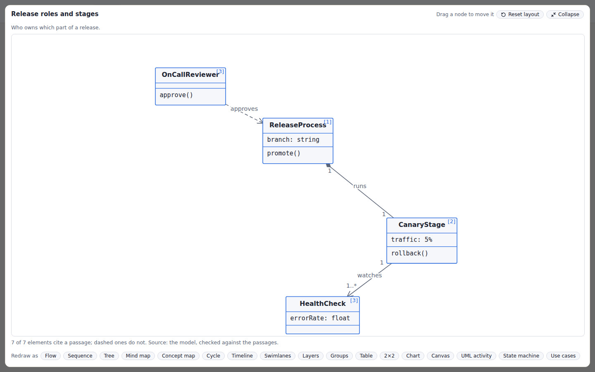

# Answer length, conversations, visuals and figures

The assistant reads three things off every question, a fourth when you name it,, and each is a choice you
can also make yourself:

| Axis | Values | Decided by |
|---|---|---|
| **intent** | `knowledge` · `procedural` · `inventory` · `search` | rules, then the planner ([answer shapes](agent-workflows.md#two-answer-shapes)); `inventory` by rules or `@pheasant` ([below](#questions-about-the-knowledge-base-itself)); `search` by `@search` |
| **depth** | `short` (default) · `medium` · `long` | rules, then the planner; or pinned; or a [first-word keyword](#first-word-keywords) |
| **visual** | `none` · `diagram` · `image`, and for a diagram a **shape** | rules; or pinned; or a keyword |
| **form** | prose (default) · `table` · `list` · `steps` · `compare` · `quotes` · `brief` | a first-word keyword only |

None of them costs a model call to decide. The rules are deterministic, so an
offline region and a connected one read a question the same way, and the
agentic planner — which already returns JSON for its search plan — may
overrule the *depth* rule in the same reply, but never a value you pinned.
`pheasant_assistant_route_total{intent,depth,visual,depth_by}` counts every
routed question; a planner that overrules the rule most of the time is telling
you the rule is wrong.

## Answer length

* **short** is the answer pheasant has always given. Its prompts, retrieval
  sizes and output limits are unchanged, so every existing evaluation
  baseline stays comparable.
* **medium** reads more (16 passages instead of the intent's default), and
  asks for a direct opening plus 3–5 headed sections.
* **long** is written in three steps: an **outline** (one call returning a
  direct overview and up to five sections, each naming the passages it will
  use), the **sections** (written in parallel, each from *only* its own
  passages, under their original `[n]` numbers so citations still verify),
  and a deterministic **stitch**. A section that errors or runs past
  `deadline_seconds` (150) is written from its passages instead, and the
  step list says which — a long answer that times out whole is worse than a
  medium one. The single-pass workflow answers `long` as `medium` in one call
  and says so.

Phrases that route: "briefly", "tl;dr" → short; "overview of", "compare",
"trade-offs", "walk me through" → medium; "in detail", "comprehensive",
"deep dive", "write-up", "report on" → long. Pin it per request with
`depth`, or with the length picker under the chat box. Every knob of a
profile is an ordinary workflow option, so anything you set explicitly
(`max_context_passages`, `max_sections`, `section_concurrency`,
`deadline_seconds`, …) wins over the profile.

## Conversations

pheasant keeps **no conversation state** — the MCP transport is stateless by
design, and only the caller knows which turns belong together. So the caller
sends the recent turns, and the region decides what they may do:

```json
POST /assistant/chat
{"question": "and what about the vault?",
 "history": [{"question": "how does credential rotation work?",
              "answer": "It rotates nightly at 02:00 [1]."}]}
```

1. **The question is found.** A follow-up ("what about it?", "the second
   one", "tell me more", or anything four words or shorter after a turn) is
   rewritten into a standalone search question — by the model when one is
   connected (one short call, only for follow-ups), and otherwise by joining
   it to the question it follows. Only *retrieval* sees the rewrite; the
   question answered is always yours. The response carries `search_question`.
2. **The evidence is kept.** The previous question is searched again and its
   hits join at half weight (`retrieved_by: "carried"`). Re-searched, not
   fetched by id: ids arrive from the caller, and re-running the question
   applies the same ACL, criteria and memory policy as any search.
3. **The model sees the conversation**, with each earlier answer's `[n]`
   markers stripped — those numbers belong to a citation list that no longer
   exists — and cut to 1,200 characters.

At most the last 6 turns are used and 50 are accepted. A question with no
history is answered byte-for-byte as before. The UI sends history
automatically; **New topic** under the chat box starts a fresh context
without clearing the thread, and **New conversation** clears both.

## Questions about the knowledge base itself

"List all documents", "which sources are there", "how many PDFs are in
notes", "what file types are indexed", "recent documents" and "sync status"
are questions about the knowledge base, not about what it says. A search
cannot answer them. It returns the passages that best match the words, and a
model writing from those would invent a catalogue. So the assistant reads such
a question and answers it from the index directly, with the same operation an
agent calls as `describe_knowledge_base` / `list_documents` (HTTP
`GET /knowledge-base/overview` / `GET /documents`). It does no search, makes no
model call and skips the history rewrite, so the answer is as fast and as
repeatable as the tool call.

Two ways in:

- **Automatically.** Deterministic rules, read before the history rewrite.
  They are deliberately narrow: a question must be *about the index* as a
  whole. "What is this knowledge base about?" and "which files mention
  rotation?" are about the content and are still searched. So is "list the
  files in the auth module", because "auth module" names no source. A follow-up
  the model rewrites ("and only the markdown ones?") is read again after the
  rewrite.
- **`@pheasant`**, anywhere in the message. Always answered from the index,
  whatever the rules think, and never sent to a search. `@pheasant` on its own
  lists what it can answer:

  ```text
  @pheasant list sources
  @pheasant list documents
  @pheasant pdfs in notes
  @pheasant list files matching deploy
  @pheasant how many documents
  @pheasant file types
  @pheasant recent documents
  @pheasant sync status
  @pheasant source notes                    # one source in detail
  @pheasant document runbooks/rotation.md   # one document in detail
  @pheasant what links to deploy.md         # its backlinks
  @pheasant links to deploy.md              # the same, paged
  @pheasant links between notes and code    # how two sources relate
  @pheasant cross-source links
  @pheasant list documents page 3           # any listing pages
  @pheasant more                            # the next page of the last listing
  ```

Every such answer ends by naming the tool it came from and the `@pheasant`
keyword, so the reader always knows how it was produced. A question that reads
close to one but was searched (for example "list the documents about
rotation") carries an `inventory_hint` that the UI shows under the answer. The
answer text itself is unchanged. The payload has `route.intent: "inventory"`,
`workflow: "inventory"` and an `inventory` block holding the tool's own result,
so an agent reads structured data rather than parsing a table.

### One source, one document, and how they link

Three narrower questions are answered the same way, from
`services.inventory_detail` (MCP `describe_source`, `describe_document`,
`list_document_links`; HTTP `GET /sources/{name}/overview`,
`GET /documents/detail`, `GET /documents/links`):

- **A source**: "tell me about the notes source", `@pheasant notes`. Its type,
  location and status, its documents by file type and by top-level folder, the
  newest five, and how many links its documents make to each other source and
  receive from them, per edge type.
- **A document**: "what links to deploy.md", "what does sync.py import",
  `@pheasant document runbooks/rotation.md`. The path can be a relative path,
  `<source>/<path>`, or any unique part of one (`rotation`); several matches
  come back as a list to choose from. The answer gives its outline (section
  headings), the symbols it defines, the documents it links to and is linked
  from (with the edge type and whether the link crosses sources), and the
  references it makes that resolve to nothing this region holds.
- **Links**: "links between notes and code", "how are the notes and code
  sources related", "cross-source links", `@pheasant links in notes`,
  `@pheasant imports in code`, and one document's links a page at a time
  (`@pheasant links to deploy.md`, `links from sync.py`), which is where a
  document's "…and 71 more" backlinks point. A summary per source pair and
  edge type, then one row per linked pair of documents.

A *link* is a graph edge whose two ends are both indexed documents: resolved
`imports`, `references`, `embeds`, `links_to` and the like, drawn at sync time
by the deterministic resolvers. Structure (`contains`, `indexes`, `has_chunk`,
`has_heading`) is never a link. Without `@pheasant`, a document question has to
name something that looks like a file (`deploy.md`), every source name has to
be a registered source, and a document the index does not hold is answered by
searching. With `@pheasant`, a miss is said.

### Long listings

A listing shows `assistant.inventory.max_items` rows (50 by default) and names
the question for the next page (`@pheasant list documents page 2`); asking it,
or `@pheasant more`, returns that page. `more` reads the conversation's
`history`, because the region keeps no chat state: each `more` after a listing
goes one page further. The `inventory.page` block carries the same thing as
data (`number`, `pages`, `next_question`) plus the HTTP `endpoint` and
`params` the listing came from. The web UI uses those to draw the listing as a
table that scrolls inside the answer and grows in place (**Load more**, **Load
all**) without asking a new question.

Listings leave out memory records (list those with `memory_list`) and internal
sources. Under `security.acl_enforced`, lists and counts include only what the
caller may read. If the automatic reading is ever wrong for your corpus, set
`assistant.inventory.mode: keyword` (only `@pheasant` routes) or `off`.

## First-word keywords

A keyword as the **first word** of a message says what kind of answer you
want, so the question does not have to be phrased for a rule to notice.
Several can lead one message (`@detailed @table …`). `@pheasant` is the one
keyword that counts anywhere. A keyword later in the sentence, or an email
address, is just text.

| Keyword | Answers with |
|---|---|
| `@source <name>`, `@doc <path>`, `@docs …`, `@links …`, `@more` | Shorthand for `@pheasant source …`, `document …`, `documents …`, `links …`, `more`. From the index, no search, no model. |
| `@search <query>` | The ranked hybrid-search hits as a numbered table, every row a citation. No model writes anything, no history rewrite, `page N` goes deeper. |
| `@brief`, `@table`, `@list`, `@steps`, `@compare`, `@quotes` | The shape of a written answer. Each adds one FORMAT instruction to the answering prompt; the grounding rules are unchanged, so every cell, bullet, step and quote still cites its passage. |
| `@overview`, `@detailed` | Medium or long length, the same pins as `depth`. |
| `@diagram`, `@image`, `@timeline`, `@flow`, `@mindmap`, `@sequence` … | A picture, the same pins as `visual`; any diagram shape works by name. `@table` is the written table. |

The keyword is removed before the question is searched or written about, and
it wins over the request's own `depth` / `visual` (it was typed into this
message; the length selector is a standing preference). The payload says what
was read in `keywords` (`used`, and `unknown` for a leading `@word` that is no
keyword, which stays in the question), and `route.decided_by` names
`keyword` for each axis a keyword set. `@table` alone, with no question, gets
the help listing. `GET /assistant/status` lists the keywords this region
answers. `assistant.keywords: false` turns them off; `@pheasant` stays
governed by `assistant.inventory.mode`.

In the web UI, **@ keywords** under the chat box (or **Ctrl+/**) opens a quick
reference: a floating card with every keyword, its example, and the
`@pheasant` phrasings, docked beside the chat column so the conversation and
the sources stay in view. It is not modal, so you keep typing while it is
open. Click a keyword to start the message with it, or an example to use it;
drag the card by its header to move it, and **Dock** puts it back. Typing
`@` as the first word shows it on its own, narrowed to what you have typed so
far, and **Tab** completes the first match.

## Visuals

Ask for one in whatever shape suits the question — "draw the release process
for a new engineer", "make a timeline of the incidents", "create a table
comparing the three rollout options", "an org chart of the teams", "plot the
error budgets by service" — or use **Draw a diagram** under an answer: for
all its cited passages, or ◇ next to one source for *that passage only*. Over
the API it is `visual: "diagram"` (or a shape name, `visual: "timeline"`) on
a chat request, or on demand:

```json
POST /assistant/visual
{"request": "the release process", "node_ids": ["chunk:docs:release.md:…"], "kind": "swimlane"}
```

### Shapes

One spec grammar (`assistant/visual_specs.py`) covers eighteen shapes,
four of them UML. The
question names one ("a timeline of", "as a table", "swim lanes", "2x2") or
leaves it to the model, and everyday names map onto the vocabulary ("org
chart" → `hierarchy`, "venn" → `groups`, "bar chart" → `chart`):

| kind | draws | reads, beyond cited nodes and edges |
|---|---|---|
| `flow` | a process or pipeline; turns top-down when it would not fit | node `shape`: box, round, pill, diamond, cylinder, hexagon, ellipse, circle, note |
| `sequence` | actors exchanging messages, in order | edges are the messages |
| `hierarchy` | a tree: part-of, reports-to, breakdown | edges parent → child |
| `mindmap` | one idea radiating out | the first node is the centre |
| `concept` | how ideas relate, as a network | labelled edges |
| `cycle` | a loop | node order is the loop |
| `timeline` | ordered or dated events | node `when` |
| `swimlane` | a process across owners | `groups` are the lanes |
| `layers` | a stack, top first | `groups` are the layers |
| `groups` | things sorted into categories | `groups` are the categories |
| `table` | a comparison | nodes are rows; `columns` and `cells` |
| `quadrant` | a 2×2 positioning | `axes`; node `x`/`y` in 0..1 |
| `chart` | numbers the passages state, bar or line | node `value`; `unit` |
| `canvas` | anything else, laid out freely | node `x`/`y` in 0..100 and `shape` |
| `class` | a UML class diagram | node `stereotype`, `attributes`, `operations`; edge `relation` (inheritance, realization, association, aggregation, composition, dependency), `from_mult`/`to_mult` |
| `activity` | a UML activity diagram | node `type` (action, initial, final, flow_final, decision, merge, fork, join); edge `guard`; partitions as `groups` |
| `state` | a UML state machine (the behavior diagram) | node `type` (state, initial, choice, final), `entry`/`do`/`exit`; edge `trigger`, `guard`, `effect`; self-transitions |
| `usecase` | a UML use case diagram | node `type` (actor, usecase); the system boundary as `groups`; edge `relation` (association, include, extend, generalization) |

UML is drawn in UML's notation — three-compartment classes with hollow
triangles, diamonds and multiplicities; start dots, fork/join bars and
decision diamonds; `trigger [guard] / effect` transitions; stick-figure
actors outside a system boundary — and exported as Mermaid's own
`classDiagram` and `stateDiagram-v2`. Its **pseudo-nodes are notation, not
claims**: a start dot, an end bullseye, a fork bar or a choice diamond needs
no label or citation and is left out of the grounding share, as is an edge
that only says where a flow begins or ends — so a diagram's punctuation can
neither prop up nor sink its content. A class member written as a plain
string shares its class's citations; one given as `{text, cites}` is checked
on its own.

A **viewpoint** in the request ("for a new engineer", "from the operator's
side") decides what the model includes and how it labels it, and is shown on
the visual.

### Grounded or declined

The model returns a spec, never markup, and pheasant checks it the way it
checks `[n]` markers. Every element a reader could take as a claim — node,
edge, lane, table cell — lists the passages (`cites`) that support it; a
citation to a passage that was not given is dropped, an element left with
none is kept but marked `inferred` (drawn dashed), and a visual that is
mostly inference is declined with a reason rather than drawn. **Numbers get
one check more:** a chart value that appears in none of its cited passages
is marked unverified and drawn dashed, whatever the model says it cites.

The model reads the **whole documents** the answer read, not their search
previews — a process whose later steps sit past the first 500 characters is
drawn with all of them. With no model connected the visual is the graph's own
edges between the cited sources, grounded by construction (as a concept map,
and it says so if you asked for another shape).

### Any model can draw

Which model is behind `assistant.model` should not decide whether a visual
appears. Models differ in exactly the ways that used to turn a request into
"No visual": a reasoning model (GPT-6, Gemini 2.5) spends hidden thinking
tokens out of the same output cap its reply comes from, some wrap JSON in
prose or a fence, and each spells the grammar its own way (`source`/`target`,
`citations`, nested `children`). The drawing path now absorbs all of it, and
none of it lowers the grounding bar:

| Layer | What it does |
|---|---|
| Prompt (`assistant.visual_prompt`) | States the reply contract at both ends of the call, lists the passage numbers that may be cited, and shows a worked reply of the shape being drawn |
| Provider | Asks for JSON where the wire can say so (OpenAI `response_format`, Gemini `responseMimeType`), and drops the field if an endpoint rejects it |
| Budget | 8,192 output tokens (or `assistant.max_output_tokens`, if higher) — room to think *and* write; a reply cut off before any text is asked again with 8,192 more (see "Models that think first" below) |
| Dialect (`assistant.visual_dialect`) | Reads the spellings models use onto the grammar before the check: renames and restructures, never adds a citation |
| Repair | A reply that still cannot be *read* gets one more turn saying what was wrong. A visual declined as *ungrounded* does not — asking for citations until the check passes would be asking the model to pass the check |
| Fallback | If the model still cannot draw, the visual is the graph's own edges between the cited sources, with `fallback_from: "model"` and a `note` saying why |

`pheasant_assistant_visual_model_total{provider,outcome}` counts how the
model half went — `drawn`, `repaired`, `ungrounded`, `unreadable`,
`no_reply`, `fallback`. After changing `assistant.model`, a rise in
`unreadable` or `no_reply` is a prompt or budget problem, not a corpus one.

### Models that think first

This applies to every model call the assistant makes, not only visuals. A
reasoning model spends hidden tokens out of the same output cap its reply
comes from, and the assistant's small structured calls (the planner, the
grader, the follow-up rewrite, a long answer's outline and sections) have
caps sized for the reply alone. When a model stops at its cap without writing
anything, the call is retried once with 8,192 more tokens. The process then
remembers that model (per provider, endpoint and model id) and gives every
later call that room from the start. A model that does not think is sent
exactly the cap it always was.

When one of those optional calls still fails, the answer's step trace says
so and why: `planner unavailable (…)`, `grader unavailable (…); answering
with what was found`, `model rewrite unavailable (…)`. A grader that cannot
answer ends the retrieval loop, as it always has, but no longer reports the
evidence as sufficient.

`visual.mermaid` is the same visual as Mermaid text where Mermaid has the
shape (flowchart, sequence, mindmap, timeline, quadrantChart, xychart);
`visual.markdown` is a table as Markdown. In a streamed answer the text
arrives first and the visual follows as its own `visual` event.

### Redraw as another shape

Every drawn visual carries `visual.redraw` — the request, the passages it
was drawn from and the shapes available. The view shows a **Redraw as** row;
choosing one calls `create_visual` with the same `node_ids` and the new
`kind`, so switching a flow to a timeline changes the shape and never the
evidence. Over MCP, an agent does the same by passing `visual.redraw.node_ids`
back to `create_visual`.

## Figures: images your documents reference

When a Markdown or HTML document shows an image the corpus holds —
``, `![[flow.png]]`, `` —
that link becomes an `embeds` edge from the document to the image artifact
(see [multi-modal ingest](multimodal-ingest.md#images-your-documents-reference)).
An answer citing that document then carries the image as a numbered **figure**:

```json
"figures": [{"figure": 1, "node_id": "file:docs:images/arch.png:branch=none",
             "relative_path": "images/arch.png", "caption": "…", "alt": "Architecture",
             "cited_in": [2], "shown": true}]
```

The model may place `[fig:1]` on its own line where the image helps; a marker
that names no figure is dropped, exactly like a dangling `[n]`. Asking to be
*shown* something ("show me the architecture diagram", "find the screenshot of
…") routes to `visual: "image"`, which answers with the figures themselves —
and, if none of the cited sources holds one, draws a diagram from the same
passages and says it was drawn rather than found.

Bytes are served by `GET /media?node_id=…` and the MCP `get_image` tool, under
the same read check as every other content operation.

## MCP Apps

`ask_knowledge_base`, `create_visual` and `get_image` each declare
`_meta.ui.resourceUri: "ui://pheasant/knowledge-view.html"` (and the
deprecated flat `ui/resourceUri`, for hosts built on the draft). A host that
supports the [MCP Apps extension](https://github.com/modelcontextprotocol/ext-apps)
renders that view — the answer with its citations, a diagram, or an image —
in a sandboxed iframe; a host that does not reads the same JSON and loses
nothing it had before.

The view is one self-contained file (`mcp_server/apps/knowledge_view.html`):
no network, no CDN, and nothing from a result is ever parsed as HTML. It
reaches back to the region only through the host — `tools/call get_image`
for an image, `tools/call create_visual` to redraw — so both are read under
the same ACL over MCP as over HTTP. An answer that already shows a figure
inline does not repeat it in the image gallery below. Clicking a
diagram node sends `ui/message` — "tell me more about …" — which the host
may turn into the next turn. A host that offers `fullscreen` also lets the view
expand (`ui/request-display-mode`) — see below.

**pheasant's own UI hosts the same view.** The chat panel loads it from
`GET /assistant/apps/knowledge-view` into `<iframe sandbox="allow-scripts">`
and speaks the host half of the protocol, so a diagram looks the same in
Claude as it does in pheasant, and a fix to it lands in both.

### Expand a visual, and move things around

A diagram opens at the size its chat slot allows. **Expand** (top right of the
visual) gives it the whole window; **Collapse**, **Esc**, or the host's own
close control brings it back.



Expanded, the diagram fills the frame and its nodes are draggable — with a
mouse, a pen or a finger. Every edge that touches a node follows it, and
**Reset layout** puts the drawn layout back exactly.



Collapsing keeps the layout you made:



It works for every shape whose nodes are free to move — flow, tree, mind map,
concept map, cycle, swimlanes, layers, canvas and the UML class, activity, state
and use case diagrams (a class carries its multiplicities with it):



Shapes whose nodes sit on something — sequence (lifelines), timeline (an axis),
2×2, chart, table and groups — expand for a bigger view but are not draggable,
because moving a node off its lifeline, axis or cell would make the picture say
something the passages did not.

Two things to know. A rearranged layout is a view: nothing about it is saved,
sent to the region or fed back into the conversation, and redrawing or asking a
new question starts from the drawn layout again. And while expanded, clicking a
node does **not** send "tell me more about …" — that message would land in a
conversation the frame is covering; it resumes on collapse.

### Zoom, pan and fit

Every drawn visual has **+**, **−** and **Fit** beside its other tools. Inline,
**Ctrl + scroll** (⌘ + scroll on a Mac) zooms around the pointer — a plain
scroll keeps scrolling the conversation — and dragging the background pans.
Expanded, any scroll zooms and a touch drag pans too. **Fit** frames the whole
diagram again, including anything you dragged outside it. Like a rearranged
layout, the zoom is a view: nothing about it is saved or sent anywhere.

In the web UI the graph canvas (the **Graph** page and the notebook's graph
panel) has the same three controls in its bottom-right corner, alongside the
mouse wheel and drag it always had.

Over MCP this is the standard `ui/request-display-mode` request. The view shows
its Expand button only if the host lists `fullscreen` in
`hostContext.availableDisplayModes`, so a host that cannot give it the window
sees the view exactly as before.

## Related

- [Customize the answering workflow](agent-workflows.md)
- [MCP tools](../mcp_tools.md) · [HTTP API](../reference/http-api.md)
- [Multi-modal ingest](multimodal-ingest.md)
