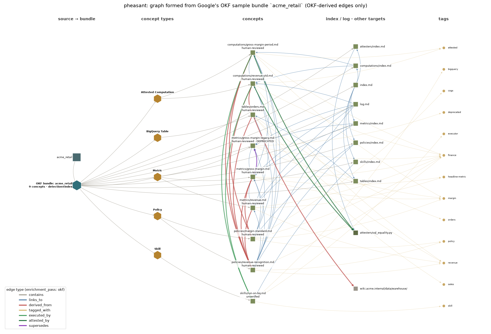
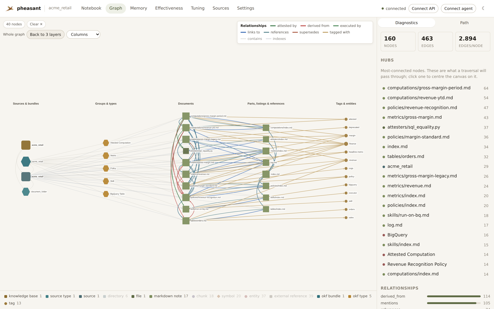
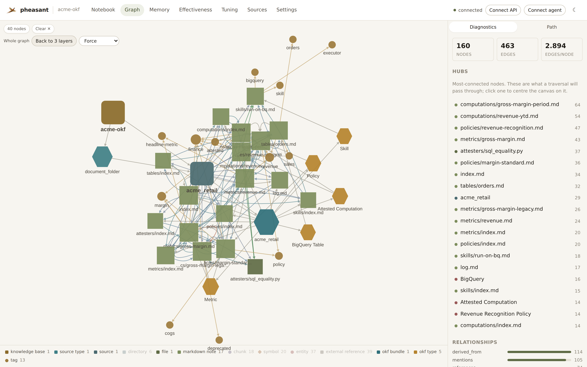

# Open Knowledge Format (OKF) bundles

[OKF](https://github.com/GoogleCloudPlatform/knowledge-catalog/tree/main/okf)
(v0.2) is Google's format for curated knowledge: a directory of Markdown
files with YAML frontmatter. Each non-reserved `.md` file is a **concept**
with a required `type`; `index.md` lists a directory; `log.md` records dated
changes; links and a few frontmatter fields relate concepts to each other.

pheasant supports OKF **implicitly**. There is nothing to register: add the
folder, repository, Obsidian vault or connector that holds a bundle exactly as
you would any document collection, and the bundle is detected while it is
indexed.

```yaml
sources:
  - name: finance-knowledge
    type: document_folder      # or markdown_folder, repository, …
    path: /data/finance-okf
```

A collection that holds no bundle produces no OKF node or edge, so its graph
is exactly what it was without this feature.

## How a bundle is detected

Parsing happens per file and is deterministic (no model, no network): a
Markdown file whose frontmatter has a non-empty string `type` is read as a
concept, an `index.md` with no frontmatter (or with `okf_version`) as a
listing, and a `log.md` with ISO-dated headings as a log. Whether a
**directory** is a bundle is then decided once the whole source is indexed:

| Detection | Rule |
|---|---|
| `explicit` | A directory whose `index.md` declares `okf_version`. |
| `index` | A directory whose `index.md` is an OKF listing and whose subtree is conformant. |
| `conformant_tree` | No listing, but a conformant subtree corroborated by a key only an OKF producer writes (`sources`, `generated`, `verified`, `stale_after`, `resource`, `runtime`, `executor`) or by a `log.md`. |

A subtree is *conformant* when it holds at least two concepts and at least
80% of its Markdown is concepts. Repository boilerplate (`README.md`,
`CHANGELOG.md`, …) is ignored. The rule is not "100%" because a bundle shipped
as a git repository usually carries a README, and the spec says to treat
everything beyond the required `type` as soft guidance. `type:` on its own is
never enough, because Hugo uses it to route pages too.

The shallowest qualifying directory wins and nothing nested in it is a second
bundle, so one source can hold several sibling bundles. Indexing Google's
whole `okf/` directory finds the four sample bundles and leaves the spec,
README and prompt files alone.

## What the graph gets

| OKF construct | Graph |
|---|---|
| The bundle | `okf_bundle` node, `source contains okf_bundle`; carries type, trust and status counts |
| `type` | `okf_type` hub per type, `bundle contains okf_type contains concept` (with `concept_id`, `status`, `trust_tier`) |
| `tags` | `tag` nodes, `concept tagged_with tag` |
| Body link | `concept links_to concept` (`relation: body_link`), beside the resolver's `references` edge |
| `sources[]` | `concept derived_from target` with `source_key`, `author`, `usage_count`, `last_modified`, `usage_window` and `citations` (footnotes citing that `id`); URLs and scope descriptors become shared `external_reference` stubs |
| Attested Computation | `executed_by` (with `receipt`), `attested_by`, `computed_by` |
| `index.md` | `links_to` with `relation: index_entry` and the entry's description; a directory target resolves to its `index.md` |
| `log.md` | `links_to` with `relation: log_entry`, every dated entry and `last_date` |
| `status: deprecated` | `current supersedes deprecated` when a deprecated concept links to exactly one current concept of its own type |

Every concept artifact also carries its parsed frontmatter as an `okf`
attribute: title, description, resource, status, `stale_after`, `generated`,
`verified`, the derived trust tier (`unverified`, `machine-confirmed` or
`human-reviewed`, §5.3), sources, and the computation contract. Graph search
matches on these. Timestamps are stored exactly as written. Staleness
(`now >= stale_after`) is **not** stored, because it changes with the clock
rather than the corpus and would move the content-addressed graph generation.

Paths resolve relative to the linking document first and to the bundle root
second. A leading `/` is bundle-relative (§6.1), and the spec's own examples
write `references/skills/run-on-bq.md` from inside `computations/`. A link
that leaves the bundle is not a bundle relationship, and a broken link is
counted on the bundle node (`broken_links`) rather than rejected.

## What it looks like

Google's `acme_retail` sample bundle, indexed as an ordinary
`document_folder`. These are only the edges the OKF pass drew:



In pheasant's Graph view, choose **Columns** from the layout menu to see a
bundle laid out the same way: bundle, concept types, concepts, listings and
references, then tags. Provenance is drawn in red and links in blue, with a
key naming every relationship colour. See
[Reading the graph](chat-and-ui.md#the-columns-layout). Concentric stays the
default.



The same region in the Force layout, with symbols and directories hidden.
The bundle is the teal hexagon and the concept types are the amber ones:



## Operating notes

- **Incremental and idempotent.** The pass runs per source after each sync.
  It walks only that source's artifacts and applies its plan as a diff, so an
  unchanged bundle writes nothing and leaves the graph generation alone. An
  edit retracts exactly the edges it removed.
- **Turning it off.** `graph.okf_bundles: false` retracts the OKF structure on
  each source's next sync. It removes only edges the OKF pass drew, never a
  parallel `references` edge.
- **An already-indexed bundle** gains its OKF structure the next time its
  files are read. Run `pheasant sync --source <name> --mode full` once to get
  it immediately.
- **Worker fleets.** The per-file reading travels with the prepared artifact.
  A worker older than this feature is refused for `.md` files only, and those
  files are prepared on the indexer instead.
